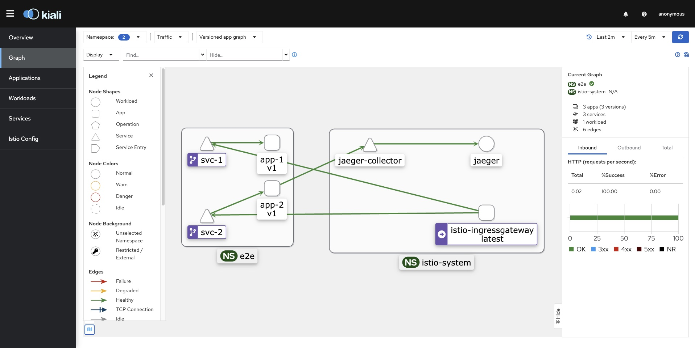
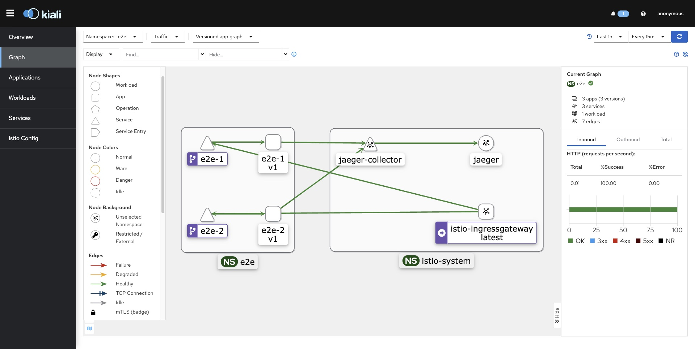
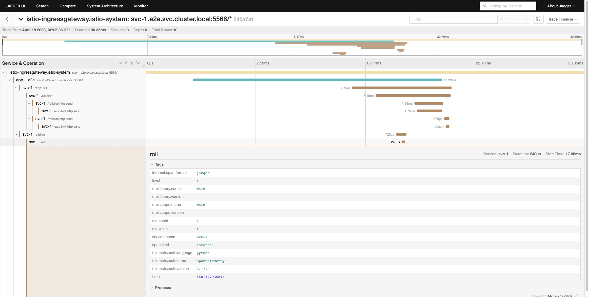

# Per Request Type Performance Anomaly Detection

## Progress
> Latest Update: `04/19/23`

### Study/Design (Due: 04/23)
- [x] Infrastructure: Minikube + Istio + Toy App
- [ ] **Demo app scenario / call-path design**
- [x] **Pull service traces from Jaeger**
- [ ] **Extract target traces from all traces pulled from Jaeger for aggregation**

### Implementation (Due: 04/29)
- [x] Consolidate manual operations into deployment scripts with Helm
- [ ] **Python decorator: log per-function's (1) total CPU time, (2) peak memory usage, (3) function name to trace**
- [ ] Python decorator: set arbitrary CPU/Mem value to trace
  - Alternative: directly generate fake traces
- [ ] **Demo app (single service)**
- [ ] Demo app (multi-service) + infra
- [ ] **Extract target traces from all traces pulled from Jaeger for aggregation**
- [ ] **Dashboard or Aggregate target traced into row counts**
  - svc1,total_cpu_time,peak_mem_usage
  - svc1_f1,svc1_f2,svc1_f3,total_cpu_time,peak_mem_usage
  - svc1,svc2,total_cpu_time,peak_mem_usage
  - svc1_f1,svc1_f2,svc2_f1,total_cpu_time,peak_mem_usage

### E2E (Due: 04/30)
- [ ] Scripts to carry out the demo scenario
  - [ ] curl APIs
  - [ ] Pull out traces from Jaeger
  - [ ] Extract target traces
  - [ ] Dashboard or Aggregate traces into row counts

### Presentation: Poster & Report
- [ ] Poster (Due: 05/03)
  - [ ] Abstract
  - [ ] Introduction
  - [ ] Related Work
  - [ ] Methodology
  - [ ] Evaluations
  - [ ] Discussions
  - [ ] Conclusions
- [ ] Report (Due: 05/06)
  - Shares the same sections as those in the poster


# Architecture

## latest (v1.1.0)


## v1.0.0



# Trace

## latest (v1.0.0)



# Build & Deployment
The all-in-one scripts `deploy.sh` provides toggles to support both infra and app deployment.
```shell
./deploy.sh <DEPLOY_INFRA_TOGGLE> <DEPLOY_APP_TOGGLE>
```
* **DEPLOY_INFRA_TOGGLE**: `TRUE` or `FALSE`
* **DEPLOY_APP_TOGGLE**: `TRUE` or `FALSE`

## Requirements
1. Install [Docker](https://docs.docker.com/engine/install/), [Minikube](https://minikube.sigs.k8s.io/docs/start/), [istioctl1.17.1](https://istio.io/latest/docs/setup/install/istioctl/), and [helm](https://helm.sh/docs/intro/install/) at your local.
   > Then the rest build and deployment steps can be fully covered in `deploy.sh`.

2. Enlarge CPU & Memory of Minikube to align with Istio's requirements.
   ```shell
   minikube config set cpus 4
   minikube config set memory 10240
   cat ~/.minikube/config/config.json
   ```
   > https://stackoverflow.com/questions/52199737/minikube-default-cpu-memory

3. Modify default random sampling from 1% to 100% (for demo).
   * Add the following setting to `istio-1.17.1/manifests/profiles/demo.yaml`:
      ```yaml
      apiVersion: install.istio.io/v1alpha1
      kind: IstioOperator
      spec:
        meshConfig:
          enableTracing: true
          defaultConfig:
            tracing:
              sampling: 100
      ```
      > https://preliminary.istio.io/latest/docs/tasks/observability/distributed-tracing/mesh-and-proxy-config/#customizing-trace-sampling

## Deploy Infra
### Create Cluster
Create a Minikube single-node cluster, and set it to active.

```shell
PROFILE=e2e-1.0.0-1.0.0

# create cluster
minikube profile $PROFILE
minikube delete
minikube start -p $PROFILE

# set $PROFILE to active
minikube profile $PROFILE
```

### Deploy Istio & Addon Dashboards
Deploy Istio and addon dashboards (such as prometheus, grafana, jaeger, and kiali).

```shell
PROFILE=e2e-1.0.0-1.0.0

# install istio dashboard addons
kubectl apply -f kubernetes/addons/prometheus.yaml
kubectl apply -f kubernetes/addons/grafana.yaml
kubectl apply -f kubernetes/addons/jaeger.yaml
kubectl apply -f kubernetes/addons/kiali.yaml

# enable addons
minikube -p $PROFILE addons enable dashboard
minikube -p $PROFILE addons enable metrics-server
minikube -p $PROFILE addons enable istio

# install istio
istioctl install --set profile=demo -y
```

#### Access Dashboard
* Prometheus
```shell
kubectl patch svc prometheus -n istio-system -p '{"spec": {"type": "NodePort"}}'
minikube service prometheus -n istio-system --url
```

* Grafana
```shell
kubectl patch svc grafana -n istio-system -p '{"spec": {"type": "NodePort"}}'
minikube service grafana -n istio-system --url
```

* Jaeger
```shell
kubectl patch svc tracing -n istio-system -p '{"spec": {"type": "NodePort"}}'
minikube service tracing -n istio-system --url
```

* Kiali
```shell
kubectl patch svc kiali -n istio-system -p '{"spec": {"type": "NodePort"}}'
minikube service kiali -n istio-system --url
```


## Deploy App
Rollout the latest app release, which include uninstall, build, package, and deploy the app.

### Uninstall App
```shell
NS=e2e
SYS=e2e

helm uninstall $SYS --namespace $NS
```

### Build App Image
```shell
PROFILE=e2e-1.0.0-1.0.0
APP_1=rolldice-1
APP_2=rolldice-2

eval $(minikube -p $PROFILE docker-env)
docker build -t $APP_1 ./app/rolldice
docker build -t $APP_2 ./app/rolldice
```

### Package Sys App
```shell
NS=e2e
SYS=e2e

mkdir -p charts/$SYS/package
PACKAGE=`helm package charts/$SYS --destination charts/$SYS/package --namespace $NS | cut -d':' -f2 | xargs`
```

### Deploy Sys App
```shell
NS=e2e
SYS=e2e

helm upgrade -i $SYS $PACKAGE --namespace $NS -f charts/values.yaml
```

# Testing
Access service APIs from local for trace generation.

## Requirements
Create a secure network tunnel between local machine and the kubernetes cluster running on Minikube
```shell
minikube tunnel --cleanup
```

## Approach 1
Curl service API with Host in header.

### Command
```shell
curl -H "Host: <SERVICE_ENDPOINT>" http://localhost:<PORT>/<API_PATH>
```
* **PORT**: `spec.servers.port.number` defined in the Gateway YAML

### Example
```shell
curl -H "Host: svc-1.dtp.org" http://localhost/app1/v1/rolldice
curl -H "Host: svc-2.dtp.org" http://localhost/app2/v1/rolldice
```
* No need to specify `PORT` when its value is 80

## Approach 2
Curl service API with port-forward.

### Command
```shell
kubectl port-forward svc/<SERVICE_NAME> -n <NAMESPACE> <LOCAL_PORT>:<CONTAINER_PORT>
```
* `CONTAINER_PORT`: `spec.containers.ports.containerPort` defined in the Deployment YAML

### Example
```shell
kubectl port-forward svc/svc-1 -n e2e 5566:5566
curl http://localhost:5566/app1/v1/rolldice
kubectl port-forward svc/svc-2 -n e2e 5567:5566
curl http://localhost:5567/app2/v1/rolldice
```


# Other Notes
1. When starting a minikube cluster with multiple nodes, image pulls fail on the second node (i.e. ErrImageNeverPull)
   > A known issue: https://github.com/kubernetes/minikube/issues/11505
2. Useful Debugging CMDs
   ```shell
   kubectl describe pod $pod_name
   kubectl logs $pod_name
   kubectl exec -it $pod_name -- bin/bash
   ```
