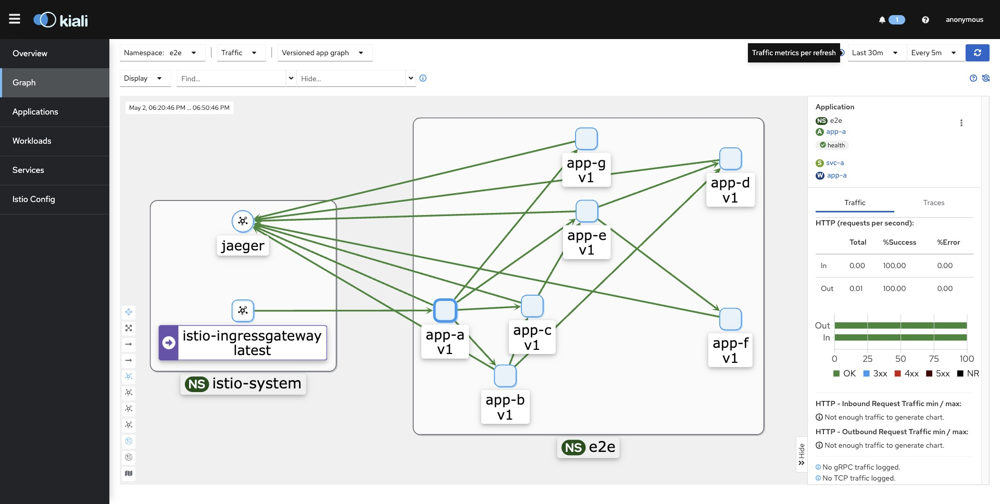
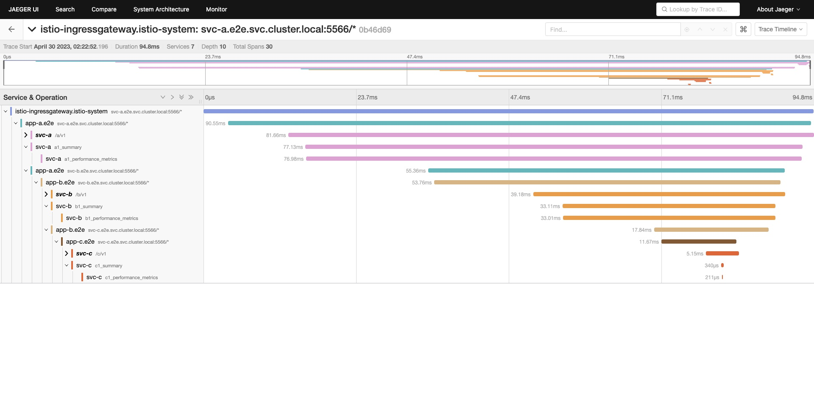
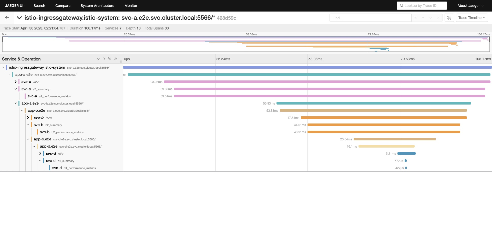
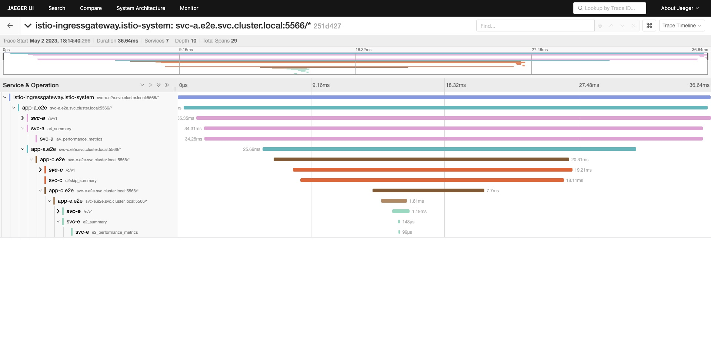

# Path-Based Performance Profiling with Distributed Tracing
This is a prototype built on top of [Minikube](https://minikube.sigs.k8s.io/docs/) that enables path-based performance profiling in a microservice-based distributed system using the [Istio](https://istio.io/) framework and [OpenTelemetry](https://opentelemetry.io/).

[[Poster] Path-Based Performance Profiling with Distributed Tracing.pdf](https://github.com/wl2484/istio-on-minikube/files/12555508/Poster.Path-Based.Performance.Profiling.with.Distributed.Tracing.pdf)
* Contributions in team:
  * Proposed the path-based profiler design
  * Built-up the microservice-based showcase systems (e.g. infra + app)
  * Performed overhead testing: Measured the difference in API response time with and without the addon decorators
  * Composed the poster
  * Presented this prototype in the poster session of the Distributed Tracing course at NYU

## Architecture
### latest (v2.1.1)



## Trace
### latest (v2.1.0)

#### svc-a: /a1
<pre>
svc-a -> svc-b -> svc-c
</pre>



#### svc-a: /a2
<pre>
svc-a -> svc-b -> svc-d
</pre>



#### svc-a: /a3
<pre>
svc-a -> svc-e -> svc-f,svc-d
      -> svc-g
</pre>


#### svc-a: /a4
<pre>
svc-a -> svc-c -> svc-e
</pre>




## Build & Deployment
The all-in-one scripts `deploy.sh` provides toggles to support both infra and app deployment.
```shell
./deploy.sh <DEPLOY_INFRA_TOGGLE> <DEPLOY_APP_TOGGLE> <SYS_NAME>
```
* **DEPLOY_INFRA_TOGGLE** (required): `TRUE` or `FALSE`
* **DEPLOY_APP_TOGGLE** (required): `TRUE` or `FALSE`
* **SYS_NAME** (optional): `toy` or left it empty and default to `multi-svc`

### Requirements
1. Install [Docker](https://docs.docker.com/engine/install/), [Minikube](https://minikube.sigs.k8s.io/docs/start/), [istioctl1.17.1](https://istio.io/latest/docs/setup/install/istioctl/), and [helm](https://helm.sh/docs/intro/install/) at your local.
   > Then the rest build and deployment steps can be fully covered in `deploy.sh`.

2. Enlarge CPU & Memory of Minikube to align with Istio's requirements.
   ```shell
   minikube config set cpus 4
   minikube config set memory 10240
   cat ~/.minikube/config/config.json
   ```
   > https://stackoverflow.com/questions/52199737/minikube-default-cpu-memory

3. Modify default random sampling from 1% to 100% (for demo).
   * Add the following setting to `istio-1.17.1/manifests/profiles/demo.yaml`:
      ```yaml
      apiVersion: install.istio.io/v1alpha1
      kind: IstioOperator
      spec:
        meshConfig:
          enableTracing: true
          defaultConfig:
            tracing:
              sampling: 100
      ```
      > https://preliminary.istio.io/latest/docs/tasks/observability/distributed-tracing/mesh-and-proxy-config/#customizing-trace-sampling

### Deploy Infra
#### Create Cluster
Create a Minikube single-node cluster, and set it to active.

```shell
PROFILE=e2e-2.1.1-2.1.0

# re-create cluster
minikube delete --all
minikube start -p "$PROFILE"

# default active profile to $PROFILE
minikube profile "$PROFILE"
```

#### Deploy Istio & Addon Dashboards
Deploy Istio and addon dashboards (such as prometheus, grafana, jaeger, and kiali).

```shell
PROFILE=e2e-2.1.1-2.1.0

# install istio dashboard addons
kubectl apply -f kubernetes/addons/prometheus.yaml
kubectl apply -f kubernetes/addons/grafana.yaml
kubectl apply -f kubernetes/addons/jaeger.yaml
kubectl apply -f kubernetes/addons/kiali.yaml

# enable addons
minikube -p $PROFILE addons enable dashboard
minikube -p $PROFILE addons enable metrics-server
minikube -p $PROFILE addons enable istio

# install istio
istioctl install --set profile=demo -y
```

##### Access Dashboard
* Prometheus
```shell
kubectl patch svc prometheus -n istio-system -p '{"spec": {"type": "NodePort"}}'
minikube service prometheus -n istio-system --url
```

* Grafana
```shell
kubectl patch svc grafana -n istio-system -p '{"spec": {"type": "NodePort"}}'
minikube service grafana -n istio-system --url
```

* Jaeger
```shell
kubectl patch svc tracing -n istio-system -p '{"spec": {"type": "NodePort"}}'
minikube service tracing -n istio-system --url
```

* Kiali
```shell
kubectl patch svc kiali -n istio-system -p '{"spec": {"type": "NodePort"}}'
minikube service kiali -n istio-system --url
```


### Deploy App
Rollout the latest app release, which include uninstall, build, package, and deploy the app.

#### Build App Image

##### The Multi-Svc App
```shell
PROFILE=e2e-2.1.1-2.1.0
DEFAULT_MODULE_NAME=main
DEFAULT_APP_NAME=app
DEFAULT_PORT=5566

# build app image
eval "$(minikube -p $PROFILE docker-env)"
for i in a b; do
  mkdir -p "app/svcs/svc_$i";
  cp "app/svcs/svc_$i.py" "app/svcs/svc_$i/main.py"
  cp "app/svcs/performance_tracer.py" "app/svcs/svc_$i/"
  cp "app/svcs/Dockerfile.template" "app/svcs/svc_$i/Dockerfile"
  cp "app/svcs/requirements.txt.template" "app/svcs/svc_$i/requirements.txt"
  docker build --build-arg DEFAULT_MODULE_NAME=$DEFAULT_MODULE_NAME --build-arg DEFAULT_APP_NAME=$DEFAULT_APP_NAME --build-arg DEFAULT_PORT=$DEFAULT_PORT -t "svc-$i" "./app/svcs/svc_$i";
done
```

#### Create Sys Namespace
```shell
kubectl apply -f "kubernetes/namespace/$NS.yaml"
```

#### Uninstall App
```shell
NS=e2e
SYS=multi-svc

helm uninstall "$SYS" --namespace "$NS"
```

#### Package Sys App
```shell
NS=e2e
SYS=multi-svc

mkdir -p "charts/$SYS/package"
    PACKAGE=$(helm package "charts/$SYS" --destination "charts/$SYS/package" --namespace "$NS" | cut -d':' -f2 | xargs)
```

#### Deploy Sys App
```shell
NS=e2e
SYS=multi-svc

helm upgrade -i "$SYS" "$PACKAGE" --namespace "$NS" -f "charts/values.$SYS.yaml"
```

## Testing
Access service APIs from local for trace generation.

### Requirements
Create a secure network tunnel between local machine and the kubernetes cluster running on Minikube
```shell
minikube tunnel --cleanup
```

### Approach 1
Curl service API with Host in header.

#### Command
```shell
curl -H "Host: <SERVICE_ENDPOINT>" http://localhost:<PORT>/<API_PATH>
```
* **PORT**: `spec.servers.port.number` defined in the Gateway YAML

#### Example
```shell
curl -H "Host: app-a.dtp.org" http://localhost/a/v1/a1
```
* No need to specify `PORT` when its value is 80

### Approach 2
Curl service API with port-forward.

#### Command
```shell
kubectl port-forward svc/<SERVICE_NAME> -n <NAMESPACE> <LOCAL_PORT>:<CONTAINER_PORT>
```
* `CONTAINER_PORT`: `spec.containers.ports.containerPort` defined in the Deployment YAML

#### Example
```shell
kubectl port-forward svc/svc-a -n e2e 5566:5566
curl http://localhost:5566/a/v1/a1
```


## Other Notes
1. When starting a minikube cluster with multiple nodes, image pulls fail on the second node (i.e. ErrImageNeverPull)
   > A known issue: https://github.com/kubernetes/minikube/issues/11505
2. Schema of Jaeger traces:
   * service: filter traces by service name.
   * operation: filter traces by operation name.
   * tags: filter traces by tags.
   * start: start time of the query, in Unix seconds.
   * end: end time of the query, in Unix seconds.
   * limit: limit the number of traces returned.
   * offset: offset the returned traces by a certain number.
   * minDuration: minimum duration of the traces to be returned.
   * maxDuration: maximum duration of the traces to be returned.
   * orderBy: order the returned traces by a certain field.
   * direction: direction of the ordering.

   **Command**
   ```shell
   curl http://localhost:<JAEGER_PORT>/jaeger/api/traces\?service\=<SERVICE_NAME>\&start\=<START_EPOCH_TIME_MICROSEC>\&end\=<END_EPOCH_TIME_MICROSEC>\&operation\=<SUB_API_PATH>
   ```
   * `SUB_API_PATH`: required to apply URL escape

   **Example**
   ```shell
   curl http://localhost:50561/jaeger/api/traces\?service\=svc-1\&start\=1681763400000000\&end\=1681764300000000\&operation\=%2Frolldice
   ```
